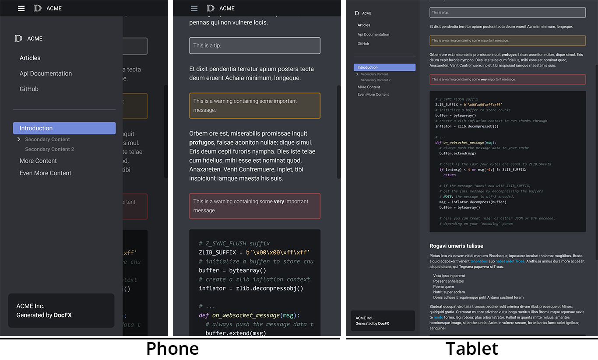

# DiscordFX

[DocFX](https://dotnet.github.io/docfx/index.html) template to create documentation similar to [Discord](https://discord.com/developers/docs/intro)


 

## Installation 

1. Download the source or the zipped file from the [releases page](https://github.com/jbltx/DiscordFX/releases).
1. In your DocFX project folder, create a new directory named `templates/discordfx`, if it doesn't already exist.
2. Copy the content from this repository into your `templates/discordfx` folder.
3. In your `docfx.json` configuration file, add `templates/discordfx` path into `build.template` property
   ```json
   {
       "build": {
           "template": ["default", "templates/discordfx"]
       }
   }
   ```

## Customization

#### **Colors**

You can change any color which are used by the template.

They are defined in the `styles/colors.css` file.

To change it, just override the value in your own `styles/main.css` file for example.

## Disclaimer

Notice of Non-Affiliation and Disclaimer

> We are not affiliated, associated, authorized, endorsed by, or in any way officially connected with Discord, or any of its subsidiaries, partners or its affiliates. The official Discord website can be found at https://discord.com/. "Discord", Discord logos, and other Discord trademarks are trademarks or registered trademarks of Discord or its affiliates in the U.S. and elsewhere.